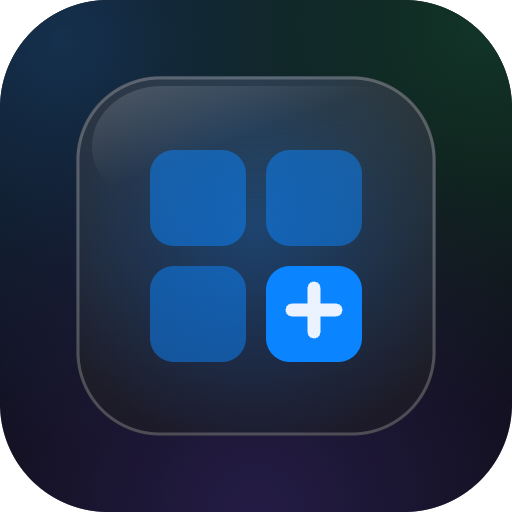

<p align="center">
  
</p># more-by-kv

[English](#english) | [繁體中文](#繁體中文)

---

## English

Centralized **"More by kv"** cross-promo for all of kv's apps: a single registry (`works.json`) plus a React glass card list component. Update the registry once — every consuming app follows on its next install/deploy.

Currently listed: [kvcc](https://kvcc.me/) · iQIYI Full View · [GTC](https://gtc.kvcc.me/) · [Indigo](https://indigo.kvcc.me/) · [a2o](https://a2o.kvcc.me/) · [Split](https://accounting.kvcc.me/)

### Install

```bash
npm i github:lp250isme/more-by-kv
```

### Usage (React)

```jsx
// once, e.g. main.jsx / layout.tsx
import 'more-by-kv/styles.css';
```

```jsx
import { MoreByKv } from 'more-by-kv';

// each app excludes itself (exclude is an array — hide as many as you like)
<MoreByKv exclude={['gtc']} lang={lang} theme={isDark ? 'dark' : 'light'} />
```

| prop | default | description |
|---|---|---|
| `exclude` | `[]` | work ids to hide (typically your own app's id) |
| `lang` | `'en'` | language key for title/desc (falls back to `en`) |
| `theme` | `'light'` | `'dark'` picks `iconDark` when available |
| `heading` | per lang | override the section heading |
| `cardClassName` | `'glass-chip'` | glass material class for each card |

The structural CSS uses the host app's `--lg-*` design tokens ([liquid-glass-kit](https://github.com/lp250isme/liquid-glass-kit) convention) and the default card material is the host's `glass-chip` class — pass `cardClassName` to use a different material.

### Usage (static / no-build apps)

Fetch the same registry at runtime and render it yourself:

```
https://cdn.jsdelivr.net/gh/lp250isme/more-by-kv@main/src/works.json
```

### Adding a work

Edit `src/works.json`:

```json
{
  "id": "myapp",
  "url": "https://myapp.vercel.app/",
  "icon": "https://myapp.vercel.app/icon.png",
  "iconDark": "https://myapp.vercel.app/icon-dark.png",
  "title": { "en": "...", "zh": "..." },
  "desc":  { "en": "...", "zh": "..." }
}
```

Commit, push — done. Apps pick it up on their next deploy (or immediately for runtime-fetch apps, subject to CDN cache).

---

## 繁體中文

集中管理所有 kv 作品的**「kv 的其他作品」**互推卡片：單一註冊表（`works.json`）+ React 玻璃卡片元件。**註冊表只改一次**，所有 app 在下次安裝/部署時自動跟上。

目前收錄：[kvcc](https://kvcc.me/) · iQIYI Full View · [GTC](https://gtc.kvcc.me/) · [Indigo](https://indigo.kvcc.me/) · [a2o](https://a2o.kvcc.me/) · [Split](https://accounting.kvcc.me/)

### 安裝

```bash
npm i github:lp250isme/more-by-kv
```

### 使用（React）

```jsx
// app 入口掛一次
import 'more-by-kv/styles.css';
```

```jsx
import { MoreByKv } from 'more-by-kv';

// 每個 app 把自己排除（exclude 為陣列，可排除多個）
<MoreByKv exclude={['gtc']} lang={lang} theme={isDark ? 'dark' : 'light'} />
```

| prop | 預設 | 說明 |
|---|---|---|
| `exclude` | `[]` | 不顯示的作品 id 陣列（通常傳自己的 id） |
| `lang` | `'en'` | 標題/描述語言（fallback `en`） |
| `theme` | `'light'` | `'dark'` 時取 `iconDark` |
| `heading` | 依 lang | 覆寫區塊標題 |
| `cardClassName` | `'glass-chip'` | 卡片玻璃材質 class |

結構 CSS 走 host app 的 `--lg-*` design token（[liquid-glass-kit](https://github.com/lp250isme/liquid-glass-kit) 慣例），卡片材質預設用 host 的 `glass-chip`，可用 `cardClassName` 換成其他材質。

### 使用（無 build 靜態頁）

直接於 runtime fetch 同一份註冊表自行渲染：

```
https://cdn.jsdelivr.net/gh/lp250isme/more-by-kv@main/src/works.json
```

### 新增作品

編輯 `src/works.json` 加一筆（id / url / icon / 雙語 title+desc），commit + push 即完成。各 app 下次部署自動更新（runtime fetch 的 app 立即生效，受 CDN 快取影響）。

## License

MIT
